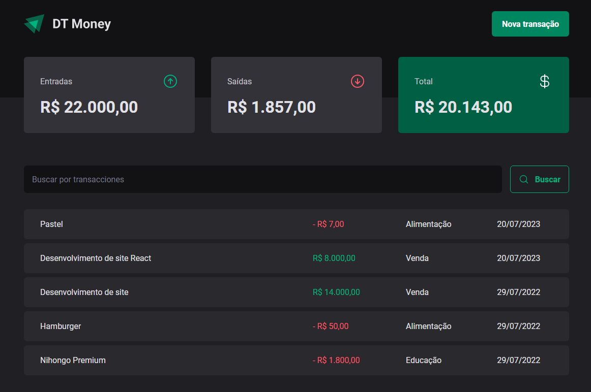

# DT-Money

<p align="center">
  

  

   <a href="https://github.com/GianDutra/DT-Money/commits/master">
    
  </a>
  
 <a href="https://dt-money-giandutra.vercel.app/">
    
  </a>
  
</p>

> Projeto desenvolvido durante o Curso Ignite da trilha de ReactJS.

## Linguagens e Tecnologias usadas

Para criar o site foi utilizado:

#### **Website**  ([React](https://reactjs.org/)  +  [TypeScript](https://www.typescriptlang.org/) + [Vite](https://vitejs.dev/))

- **[React Hook Form](https://react-hook-form.com/)**
- **[Styled Components](https://styled-components.com/)**
- **[Phosphor Icons](https://phosphoricons.com/)**
- **[RadixUI](https://www.radix-ui.com/)**
- **[Axios](https://axios-http.com/)**
- **[Zod](https://github.com/colinhacks/zod)**
  
#### **API**
- **[JsonServer](https://github.com/typicode/json-server)**

## Ajustes e melhorias

- [x] Criar uma nova transação usando json-server API
- [x] Filtrar as transações por busca
- [x] Mostrar saldo calculado 
- [x] Deploy do JsonServerAPI para funcionar no Vercel 

## 💻 Pré-requisitos

Antes de começar, verifique se você possui instalado:

* [Node.js](https://nodejs.org/en/)
* [Git](https://git-scm.com)

## 🚀 Instalando <DT-Money>

 
```bash

# Clone este repositório
$ git clone git@github.com:GianDutra/DT-Money.git

# Acesse a pasta do projeto no seu terminal
$ cd DT-Money

# Instale as dependências
$ npm install

# Rode o aplicativo no modo de desenvolvedor
$ npm run dev

# O aplicativo vai abrir por padrão na porta: 3000 - vá para http://localhost:3000/

```

---


## 👨‍💼 Autor

<table>
  <tr>
    <td align="center">
      <a href="#">
        <br>
        <sub>
          <b>Gian Dutra</b>
        </sub>
      </a>
    </td>
  </tr>
</table>
